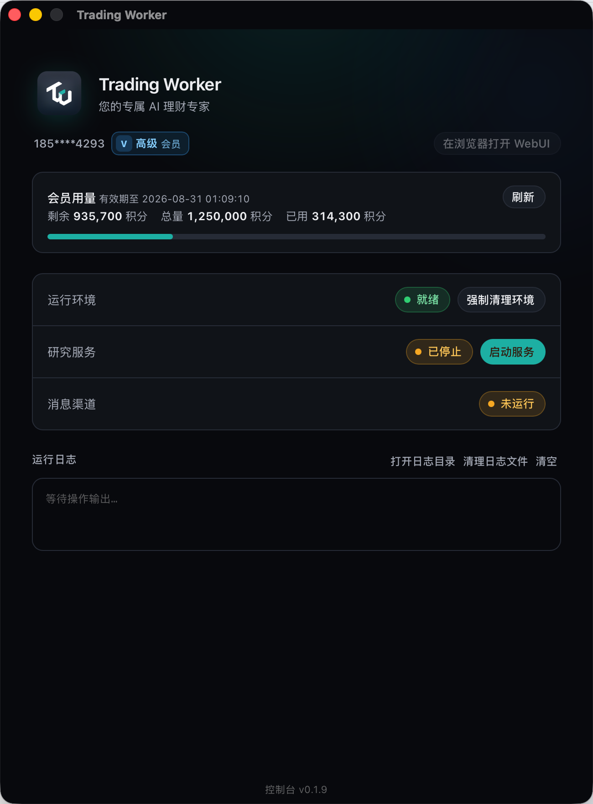
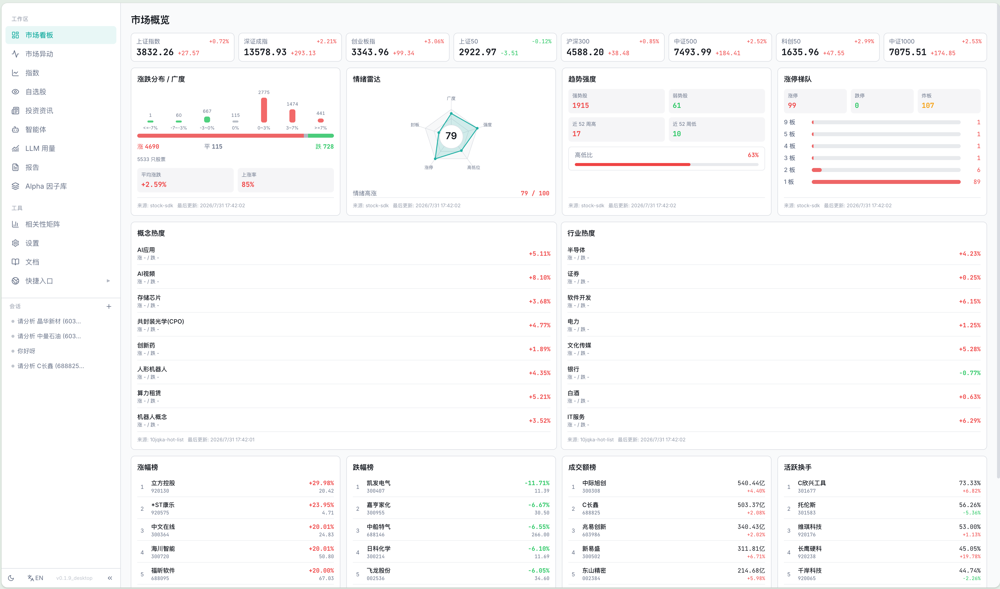
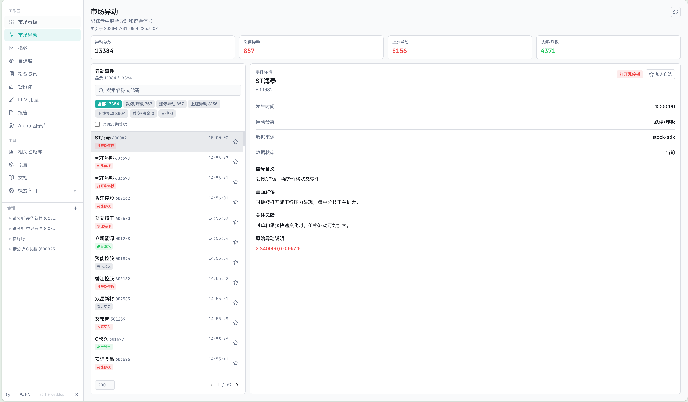
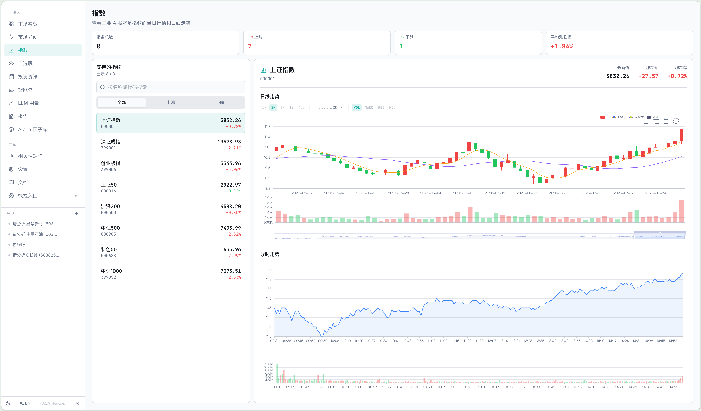
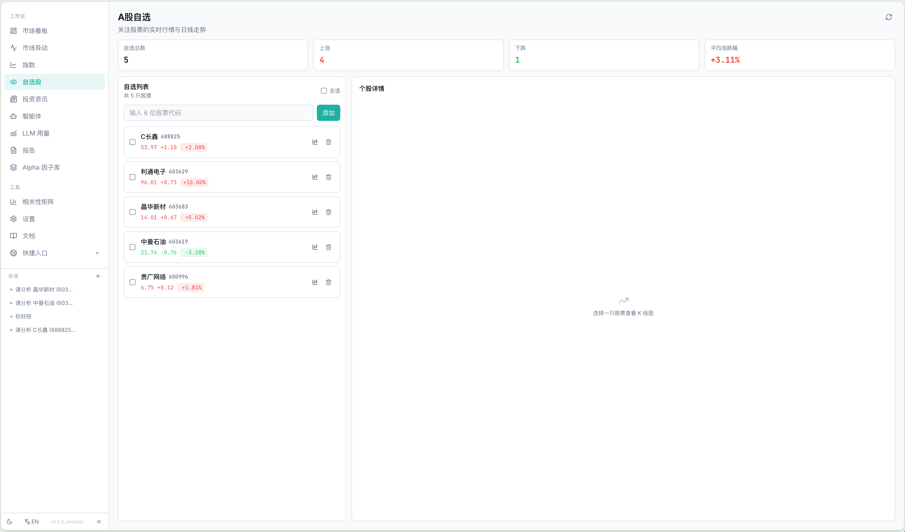
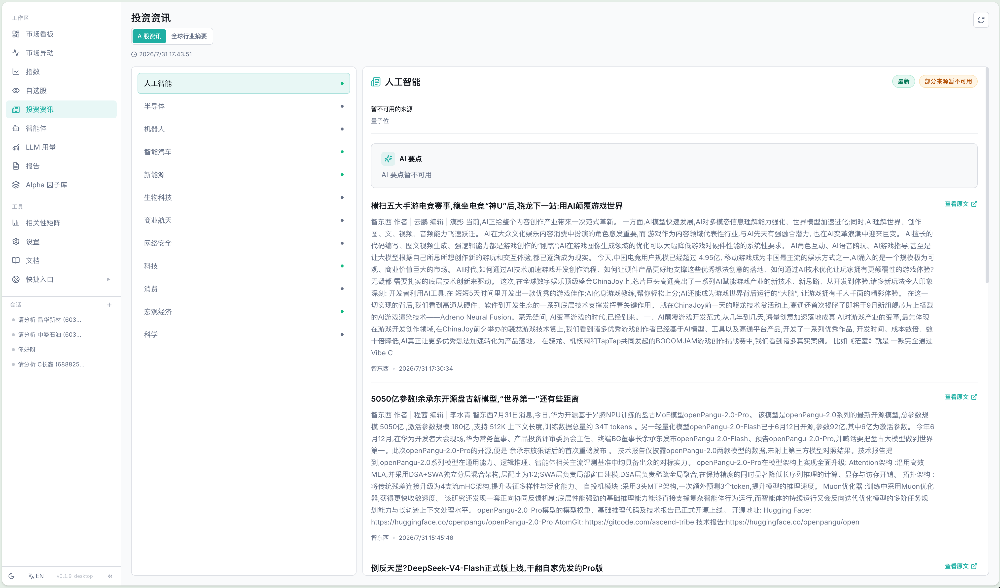
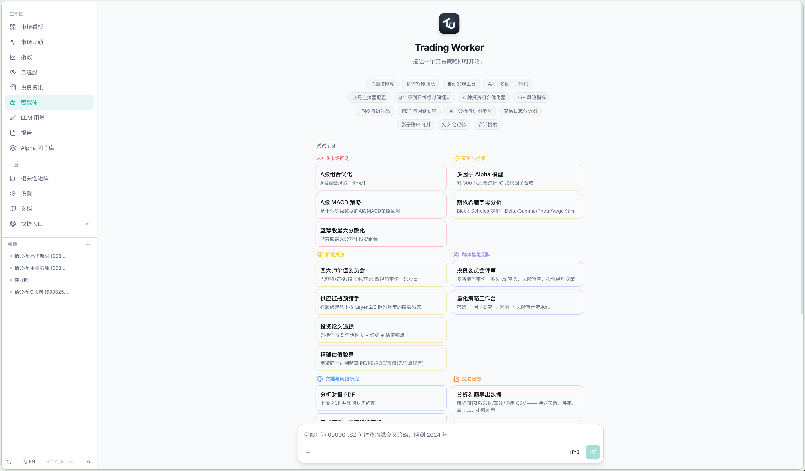
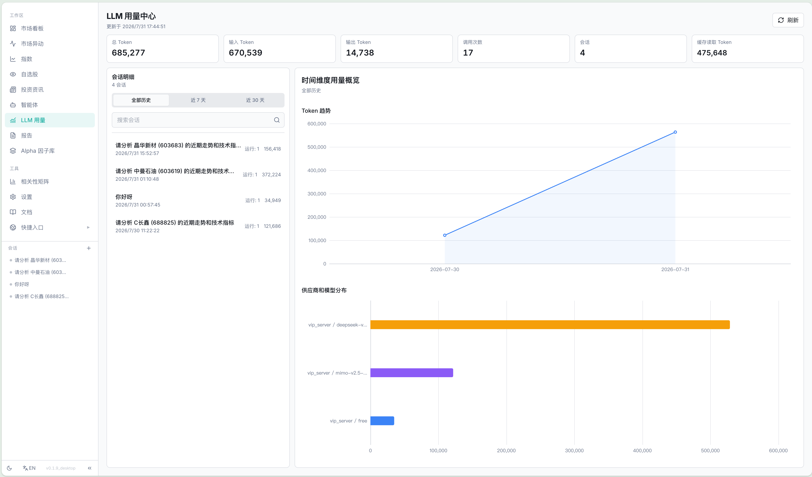
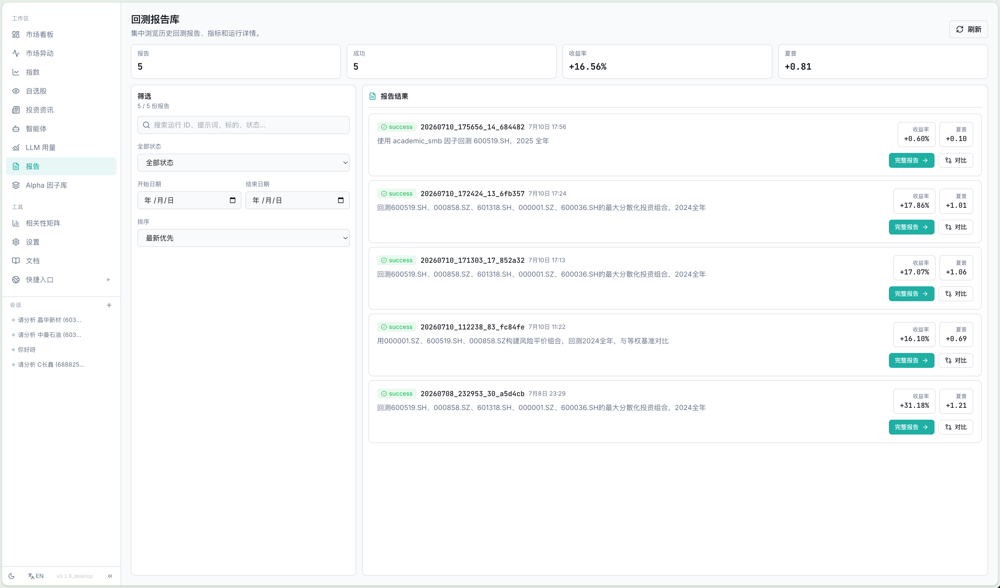
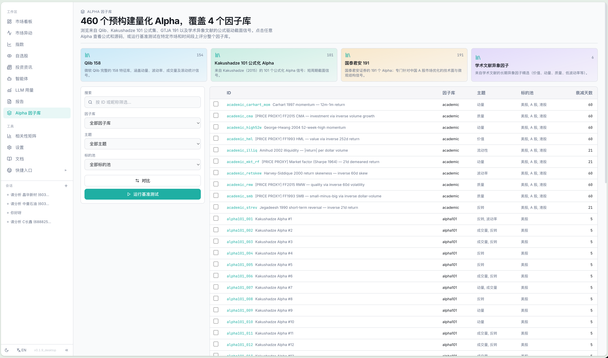

<p align="center">
  <a href="https://github.com/HKUDS/Vibe-Trading#readme">上游完整文档（English / 日本語 / 한국어 / العربية）</a>
</p>

<p align="center">
  
</p>

<h1 align="center">Trading Worker</h1>

<p align="center">
  <strong>您的专属 AI 理财专家</strong>
</p>

<p align="center">
  基于 <a href="https://github.com/HKUDS/Vibe-Trading">HKUDS/Vibe-Trading</a> 的桌面化研究工作台，
  把 AI 研究、市场洞察、回测与本地运行时管理整合到一套 macOS / Windows 体验中。
</p>

<p align="center">
  <a href="https://github.com/NieAnSHOW/Vibe-Trading-Desktop/releases">下载桌面版</a>
  &nbsp;&middot;&nbsp;
  <a href="#功能一览">功能一览</a>
  &nbsp;&middot;&nbsp;
  <a href="#快速开始">快速开始</a>
  &nbsp;&middot;&nbsp;
  <a href="#上游项目与文档">上游文档</a>
</p>

<p align="center">
  
  
  
  <a href="LICENSE"></a>
</p>

## English summary

**Trading Worker** is a desktop research workspace built on top of
[HKUDS/Vibe-Trading](https://github.com/HKUDS/Vibe-Trading). Its desktop
console manages the local runtime and opens the research WebUI in your system
browser. The workspace brings together AI-assisted research, market dashboards,
watchlists, news, backtesting, and model controls. For the complete upstream
feature guide and multilingual documentation, visit the
[upstream README](https://github.com/HKUDS/Vibe-Trading#readme).

## 这是什么

Trading Worker 由两部分组成：一个原生桌面控制台和一个在系统浏览器中打开的研究工作区。

桌面控制台负责安装或修复依赖、启动和停止本地研究服务、打开 WebUI、查看日志与管理运行环境；研究工作区则用于与 AI Agent 协作、查看市场、维护自选股、阅读资讯、运行回测和管理模型。研究服务仅监听本机回环地址 `127.0.0.1`。

| 层级 | 技术 | 作用 |
| --- | --- | --- |
| 桌面控制台 | Tauri 2.x + Rust | 管理嵌入式运行时、依赖安装、服务生命周期与本地日志 |
| 研究工作区 | React 19 + TypeScript + ECharts | Agent 对话、市场数据、资讯、自选股、回测与可视化 |
| 研究引擎 | Python 3.12 + FastAPI + LangGraph | 金融研究、回测、数据源、技能与本地 API 服务 |

## 核心能力

### 本地桌面运行时

- 安装包内含启动所需的 Python 运行时与桌面控制台，首次运行可引导安装完整研究依赖。
- 可在控制台启动、停止和健康检查本地研究服务，并通过默认浏览器打开 WebUI。
- 服务、日志、会话和用户配置保存在本机运行目录中，升级时保留用户数据。

### AI 研究工作台

- 面向自然语言的金融研究 Agent，结合多种金融分析技能、数据工具与回测能力。
- 支持 A 股、美股、港股、加密资产、期货和外汇等研究与策略验证场景。
- 在同一工作区完成研究对话、报告查看、相关性分析、基准比较与 Alpha 研究。

### 市场洞察与自选管理

- A 股市场看板汇总关键行情、板块与市场宽度信息。
- 自选股与实时盯盘将“看盘到交给 Agent 分析”的工作流连在一起。
- 市场脉搏、投资资讯与指数详情帮助快速定位值得研究的事件与标的。

### 会员与模型控制

- 支持登录、注册与可选的登录记忆；个人中心展示服务端提供的会员状态与权益信息。
- 可使用托管模型，也可切换为自定义 LLM 配置；用量中心帮助理解近期模型消耗。
- 托管模型所需的 provider 密钥按需注入本地进程，不作为用户配置写入磁盘。若启用“记住登录”，登录令牌会保存在本机；为解密托管模型凭据，桌面端会在本机保存会员私钥。涉及登录、会员或托管模型时，应用会与相应服务通信。

## 功能一览

以下截图按产品工作流顺序展示 Trading Worker 的桌面控制台与研究工作区。

### 0. 桌面控制台

<p align="center">
  
</p>

安装、修复依赖、启动本地研究服务和打开 WebUI 都在桌面控制台完成。

### 1. 市场看板

<p align="center">
  
</p>

集中查看主要指数、市场宽度、板块和行情概览。

### 2. 市场异动

<p align="center">
  
</p>

聚合值得跟进的价格、成交量与市场信号，帮助快速发现异常变化。

### 3. 指数详情与盘中图表

<p align="center">
  
</p>

在指数详情中查看 K 线、盘中走势、成交量与相关市场数据。

### 4. 自选股

<p align="center">
  
</p>

维护关注标的，并将行情上下文直接交给 Agent 继续研究。

### 5. 投资资讯

<p align="center">
  
</p>

以研究主题与市场线索组织资讯，帮助快速筛选值得跟进的事件。

### 6. AI 研究 Agent

<p align="center">
  
</p>

从研究模板或自然语言问题开始，调用金融技能与工具推进分析。

### 7. LLM 用量中心

<p align="center">
  
</p>

按模型与时间维度了解 LLM 用量，支持更清晰地管理研究成本。

### 8. 回测报告

<p align="center">
  
</p>

在工作台中查找、筛选和打开已完成的研究与回测结果。

### 9. Alpha Zoo

<p align="center">
  
</p>

浏览内置因子库，筛选候选 Alpha 并进入进一步的研究与验证。

## 快速开始

### 下载桌面应用

1. 前往 [Releases](https://github.com/NieAnSHOW/Vibe-Trading-Desktop/releases) 下载对应平台安装包。
2. 启动 Trading Worker，在桌面控制台中完成登录或配置，并按提示安装或修复研究依赖。
3. 当服务就绪后，点击“打开 WebUI”，在系统默认浏览器中进入研究工作区。

支持的平台和空间要求：

- macOS 12.0 及以上，Apple Silicon 原生版本。
- Windows 10 及以上，x64 版本。
- 完整研究环境约需 2 GB 磁盘空间。

当前 macOS 发行包未签名时，浏览器下载后可能带有隔离标记。将应用拖入 `/Applications` 后，可执行：

```bash
xattr -cr "/Applications/Trading Worker.app"
```

该命令仅移除该应用的下载隔离标记，不会修改系统安全设置。完整安装说明、已知限制与运行时说明见 [桌面应用文档](docs/desktop/README.md)。

### 本地开发

```bash
# 后端 API，默认 :8899
pip install -e ".[dev]"
vibe-trading serve

# 前端开发服务器，默认 :5899
cd frontend
npm install
npm run dev
```

构建桌面发行包：

```bash
# macOS
bash scripts/desktop/build-dmg.sh

# Windows PowerShell
.\scripts\desktop\build-windows.ps1
```

更多构建细节见 [桌面构建文档](docs/desktop/README.md) 与 [贡献者指南](AGENT_CONTRIBUTOR_GUIDE.md)。

## 上游项目与文档

Trading Worker 基于 [HKUDS/Vibe-Trading](https://github.com/HKUDS/Vibe-Trading) 构建。上游项目提供完整的研究能力说明、多语言 README、Roadmap 与社区信息；本仓库专注于桌面分发、桌面控制台及其配套研究体验。

| 文档 | 内容 |
| --- | --- |
| [上游 README](https://github.com/HKUDS/Vibe-Trading#readme) | 完整功能介绍、多语言文档、News 与 Roadmap |
| [上游 Wiki](https://vibetrading.wiki/) | 教程、研究实验室与 Alpha Library |
| [桌面应用文档](docs/desktop/README.md) | 安装、系统要求、运行时与构建说明 |
| [贡献者指南](AGENT_CONTRIBUTOR_GUIDE.md) | 开发与高风险交易路径的安全规则 |
| [CHANGELOG](CHANGELOG.md) | 本仓库变更记录 |
| [SECURITY](SECURITY.md) | 安全问题上报方式 |

## 安全说明

- 研究服务仅绑定 `127.0.0.1`，不会直接暴露到局域网或公网。
- 桌面控制台在退出时会终止其管理的本地服务进程。
- 实盘交易、订单闸门、mandate、kill switch 与审计路径属于高风险功能；使用和贡献前请阅读 [安全贡献指南](AGENT_CONTRIBUTOR_GUIDE.md)。
- API 密钥与会员服务具有不同的配置和通信方式。使用前请核对设置页、服务提供方与本地环境配置。

## License

本项目采用 [MIT License](LICENSE)。Trading Worker 遵循其上游项目 [HKUDS/Vibe-Trading](https://github.com/HKUDS/Vibe-Trading) 的许可证约定。
