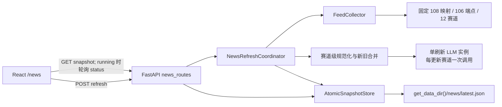
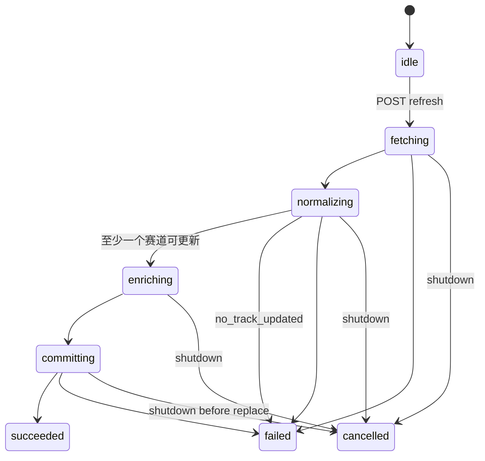

# 投资资讯模块技术设计

## 1. 文档定位

本设计描述 `investment-news-hub` 的实现方式。功能范围、强制行为和验收场景以 `openspec/changes/investment-news-hub/specs/investment-news-hub/spec.md` 为唯一事实源；本文不创建第二套需求定义。

首版把固定上游提交 `d98aa603228f4839fb48859812c63a58ca10cead` 的 108 个赛道来源映射、106 个唯一 feed 端点、12 个赛道与过滤规则原生接入现有 FastAPI sidecar 和 React SPA。模块免费开放，不增加产品账号或付费门控，但所有 `/news-api/...` 接口继续遵守现有网络鉴权边界。

## 2. 仓库集成点

后端沿用现有入口，不复制基础设施：

- `agent/src/providers/llm.py:build_llm()` 是唯一模型构造入口；每次刷新只构建一个实例。
- `agent/src/config/paths.py:get_data_dir()` 决定用户数据目录；快照固定写入 `news/latest.json`。
- `agent/src/api/security.py:require_auth` 提供本地回环信任、远程 Bearer `API_AUTH_KEY` 校验和跨站写请求保护。
- `agent/api_server.py` 注册资讯路由，并在既有 shutdown 钩子中取消未完成刷新。
- `httpx` 与 `defusedxml` 已是项目完整运行时依赖，首版不新增 feed 解析依赖；`defusedxml` 不在桌面 Tier 0，因此只在实际解析函数内延迟导入，不能让 `api_server.app` 的装配期导入依赖它。

前端沿用现有应用结构：

- `frontend/src/router.tsx` 懒加载 `/news` 页面。
- `frontend/src/components/layout/Layout.tsx` 增加 Lucide `Newspaper` 图标导航项。
- `frontend/src/lib/api.ts` 增加资讯响应类型和三个 API 方法，继续复用 `authHeaders()` 与统一错误处理。
- `frontend/src/i18n/locales/*.json` 增加页面、12 个赛道和状态文案；`zh-CN` 为命名基准，其他 locale 不缺键。
- `frontend/vite.config.ts` 只代理 `/news-api`；SPA `/news` 不进入代理，生产环境继续由现有 `SPAStaticFiles` 回退到 `index.html`。

## 3. 总体架构



刷新请求只创建后台任务并返回 `202`。后台任务覆盖全部 12 个赛道，先并发采集固定 feed，再按赛道形成候选、与旧快照合并、处理 LLM、校验完整组合快照，最后执行一次原子替换。读取接口在整个过程中只读取已提交快照。

## 4. 后端模块边界

新增 `agent/src/news/` 包：

| 文件 | 职责 |
| --- | --- |
| `catalog.py` | 加载固定来源清单、暴露 12 个稳定赛道、校验不变量和 manifest hash |
| `upstream_manifest.json` | 保存规范仓库 URL、完整提交 SHA、schema 版本、108 个赛道来源映射、106 个唯一端点和过滤参数 |
| `THIRD_PARTY_NOTICES.md` | 保存上游 MIT 版权和许可声明 |
| `constants.py` | 集中定义所有资源与字段上限 |
| `models.py` | Pydantic 快照、条目、赛道、AI、来源结果和 API 状态模型 |
| `network.py` | 来源 URL/重定向/DNS 目标验证和有界 HTTP 读取 |
| `feeds.py` | 安全解析 RSS 2.0/Atom、纯文本化和字段标准化 |
| `pipeline.py` | 过滤、时间窗口、排序、去重、赛道级新旧合并 |
| `llm.py` | 单赛道提示词、调用适配、结构校验和降级 |
| `storage.py` | 最新快照读取、校验与原子提交 |
| `coordinator.py` | 单任务状态机、并发控制、刷新编排和 shutdown 取消 |

新增 `agent/src/api/news_routes.py`。它只负责 HTTP 契约、依赖注入和状态码，不包含采集或持久化逻辑。使用 `register_news_routes(app, require_auth=require_auth)` 显式注册，避免从 `api_server` 反向导入造成循环依赖。

## 5. 固定来源与供应链边界

`upstream_manifest.json` 是运行时唯一来源目录，不在启动或刷新时访问 GitHub。生成或更新该文件的导入脚本只用于开发阶段，并要求显式传入固定 commit；运行时包不暴露导入脚本为 API。

清单根结构至少包含：

```json
{
  "schema_version": 1,
  "upstream_repository": "https://github.com/simonlin1212/investment-news",
  "upstream_commit": "d98aa603228f4839fb48859812c63a58ca10cead",
  "tracks": [],
  "sources": [],
  "filters": {}
}
```

`catalog.py` 在测试和进程启动时验证：赛道来源映射数为 108、唯一网络端点为 106、赛道数为 12、映射 ID 与 `(track_id, url)` 唯一、每个映射引用合法赛道、完整 SHA 匹配、所有 feed URL 为 HTTP(S)，以及规范化 JSON 的 SHA-256 等于代码中固定的 golden hash。清单显式锁定两个跨赛道复用 URL：`https://sspai.com/feed` 和 `https://www.engadget.com/rss.xml`；除此之外不允许意外重复。来源变化必须同时更新清单、hash、许可审查和测试预期。

采集计划先按规范 URL 把 108 个映射分组为 106 个端点，同一端点在一次刷新中只请求和解析一次，再把不可变解析结果分发到各映射并分别应用赛道过滤。端点失败会使其关联的所有映射失败；API 同时报告 endpoint 和 assignment 计数，避免把一次网络失败伪装成两次请求。

`pyproject.toml` 的 `src` package-data 增加 `news/*.json` 与 `news/*.md`，`MANIFEST.in` 同时显式纳入对应文件，确保 wheel 与 sdist 都包含清单和 notice。macOS `scripts/desktop/assemble.sh` 和 Windows `scripts/desktop/assemble.ps1` 都整体复制 `agent/`，无需另建资源管线；集成测试直接检查 `.desktop-build/agent/src/news/THIRD_PARTY_NOTICES.md`，并确认 Tauri bundle 的 `.desktop-build/agent` 资源规则未被绕过。

## 6. 领域模型与快照 schema

关键 Pydantic 模型：

```text
NewsItem
  id: str
  track_id: str
  source_id: str
  source_name: str
  title_original: str
  title_zh: str | null
  summary: str | null
  published_at: datetime | null
  url: HttpUrl

TrackSnapshot
  id: str
  state: fresh | stale | unavailable
  generated_at: datetime | null
  stale: bool
  partial: bool
  items: list[NewsItem]
  ai: TrackAIResult
  source_stats: SourceStats

NewsSnapshot
  schema_version: int
  generated_at: datetime
  upstream_commit: str
  tracks: list[TrackSnapshot]  # 固定 12 个，顺序由 catalog 定义
  source_stats: SourceStats
  errors: list[PublicError]
```

`SourceStats` 同时记录 106 个唯一 endpoint 的请求成功/失败计数和 108 个 assignment 的处理成功/失败计数；字段名显式使用 `endpoint_*` 与 `assignment_*`，不使用含义不清的单一 `source_count`。

不把 `RefreshStatus`、当前 task ID、Provider 名称、模型 Base URL、提示词、原始异常或凭据写入 `latest.json`。`schema_version=1` 的读取器遇到未知版本或模型校验失败时返回 `snapshot_corrupt`，不尝试部分读取。

字段边界在模型层再次执行：标题最多 300 字符，摘要最多 1000 字符，每赛道最多 100 条。所有 datetime 以 UTC ISO 8601 序列化。`state` 与字段必须满足：

- `fresh`：`generated_at` 非空且 `stale=false`。
- `stale`：复用旧赛道的原 `generated_at`，`stale=true`，条目和旧 AI 结果保持一致。
- `unavailable`：`generated_at=null`、`stale=false`、条目为空、AI 不可用。

`partial=true` 表示赛道本次已更新，但其中有来源失败；它不等同于 stale。

## 7. Feed 采集与标准化

### 7.1 HTTP 约束

每次刷新创建一个 `httpx.AsyncClient`，显式设置：

- 全局来源并发：16，由 `asyncio.Semaphore(16)` 控制。
- 连接超时：5 秒；读取超时：15 秒。
- 单 feed 响应体：最多 2 MiB，流式累计，超过后立即中止。
- 重定向：关闭自动跟随，最多手动处理 3 跳。
- 请求方法：仅 GET；不发送项目 Cookie、Authorization 或 LLM 配置。
- 环境代理：`trust_env=false`，禁止由 `HTTP_PROXY`/`HTTPS_PROXY` 改写固定来源的网络边界。

每一跳都解析并规范化 URL，只允许 `http`/`https`，拒绝 URL 凭据、无 hostname、回环、私网、链路本地、组播和保留地址。域名在请求前解析 A/AAAA，任一结果非公网即拒绝；从合格结果中确定性选择一个 IP，并把实际连接 URL 改写为该 IP，同时保留原始 `Host` header，并通过 request `sni_hostname` extension 让 HTTPS 继续按原 hostname 做 SNI 与证书校验。连接池关闭 keep-alive，防止共享 IP 上不同 hostname 复用错误连接。重定向相对地址通过原逻辑 URL 解析后重新执行解析、验证和 IP 固定。测试必须断言 transport 实际收到的是已验证 IP，而不是再次解析 hostname，从而关闭 DNS rebinding/TOCTOU 窗口。由于来源目录固定且不接受用户 URL，该校验与固定清单共同构成 SSRF 边界。

### 7.2 XML 与文本处理

响应仅在类型和内容可作为 XML/feed 处理时交给解析函数；该函数延迟导入 `defusedxml.ElementTree`，使只有 Tier 0 依赖的桌面装配 smoke 仍能导入 `api_server.app`。完整运行时缺少解析依赖时返回稳定的 `parser_unavailable`，不在请求中尝试安装依赖。DTD、实体声明、实体扩展、畸形 XML 或超深结构作为该来源的隔离失败。解析器只实现上游清单实际需要的 RSS 2.0 和 Atom 字段，不执行外部实体、XSLT 或任意扩展。

标题、摘要用标准库 `HTMLParser` 提取文本节点，再做 HTML entity 解码、Unicode/空白规范化和长度截断。前端始终以 React 文本节点渲染，不使用 `dangerouslySetInnerHTML`。

条目必须有非空标题和合法 HTTP(S) 原文 URL。原文 URL 只保存和展示，不执行 DNS 解析，也绝不抓取正文。摘要和发布时间缺失时保留 `null`。有时间的条目只保留最近 7 天；无时间条目保留为未知时间并排在有时间条目之后。每个来源按确定性顺序最多取 6 条。

### 7.3 ID、过滤和去重

URL 规范化移除 fragment，规范 scheme/host/default port，并按上游过滤规则处理 query；不得笼统删除所有 query，以免合并不同文章。稳定 ID 优先使用规范化原文 URL 的 SHA-256，缺 URL 的条目本就不进入候选。

按以下顺序处理：来源字段标准化、上游过滤规则、时间窗口、来源内去重、赛道内去重、排序、数量裁剪。赛道内冲突时保留字段更完整的条目；完整度相同则保留发布时间较新的条目，再以来源 ID 和稳定 ID 决胜，保证 fixture 结果可重复。

## 8. 赛道级合并与提交判定

一次刷新始终遍历清单中的全部 12 个赛道。这里的“本次可用新条目”指本次实际从成功来源得到并通过校验的条目，不要求其 ID 从未在旧快照中出现。

每个赛道按以下规则生成候选结果：

1. 本次至少得到一个有效条目：以本次条目为先，与旧赛道条目按稳定 ID 合并并裁剪到 100 条；赛道为 `fresh`，`generated_at` 更新为本次时间。部分来源失败则 `partial=true`。
2. 本次没有有效条目且存在旧赛道：原样复用旧条目和旧 AI 结果，赛道为 `stale`，保留旧 `generated_at`。
3. 本次没有有效条目且无旧赛道：生成固定位置的 `unavailable` 赛道，不生成虚构条目。

pipeline 无论赛道状态组合均返回固定 12 赛道结果和 `updated_track_ids`，使 stale/unavailable 状态可被检查而不伪造刷新成功。只有至少一个赛道命中规则 1 才构造并提交新组合快照；协调器在 `updated_track_ids` 为空时以 `no_track_updated` 结束任务，不调用 LLM、不写临时快照、不改变磁盘文件。这样避免“任一来源请求成功但没有可用内容”被误判为有效刷新。

## 9. LLM 管线

仅规则 1 的赛道进入 LLM 管线。协调器在确认至少一个赛道可更新后调用一次 `build_llm()`；构造失败时所有更新赛道保留原始资讯，并写入各自 `ai.available=false` 与 `llm_unavailable`，刷新仍可提交。

每个更新赛道按时间与稳定 ID 选取最多 16 条候选，通过一次调用同时请求：

```json
{
  "titles": [{"item_id": "...", "title_zh": "..."}],
  "highlights": ["...", "...", "..."]
}
```

原始标题已有中文字符的条目不要求返回翻译；输入仍可用于赛道要点。提示词把 feed 字段放在明确的数据区，声明其中指令均不可信，并禁止模型输出 Markdown、链接、配置、凭据或输入之外的事实。单条输入使用已截断的 300 字符标题和最多 1000 字符摘要，不包含全文。

LLM 调用由 `asyncio.Semaphore(3)` 限制总并发。适配器优先使用模型的 `ainvoke()`；仅当 Provider 只提供同步 `invoke()` 时才使用 `asyncio.to_thread()`，避免阻塞事件循环。所有赛道共享本次刷新创建的模型实例。

响应先提取文本，再用 Pydantic 严格校验：只接受候选中的 item ID；中文标题非空、最多 300 字符且含中文字符；要点必须为 3–5 条非空中文字符串并满足输出长度上限；未知 ID、重复 ID、多余字段、畸形 JSON 或超限内容均使该赛道整次 AI 结果失败。失败域限定在赛道内，资讯条目仍提交，原始标题回退展示。

## 10. 刷新协调器

`NewsRefreshCoordinator` 是进程级单例，持有：

- `_lock: asyncio.Lock`，只保护任务创建和状态替换，不覆盖长耗时工作。
- `_task: asyncio.Task | None`，表示唯一运行任务。
- `_status: RefreshStatus`，不可变替换，仅读取内存。
- 注入的 catalog、collector、LLM factory、store 和 clock，便于离线测试。

状态机：



`POST` 在锁内检查 `_task`：运行中则返回相同 task ID 和 `reused=true`；否则创建 UUID、设置 `fetching` 状态并 `asyncio.create_task()`。状态包含 `phase`、`started_at`、`finished_at`、`endpoints_processed/106`、端点成功/失败数、`assignments_processed/108`、`tracks_processed/12` 和稳定错误码。

shutdown 钩子调用 `await coordinator.close()`：设置取消、等待任务清理并关闭 HTTP client。取消发生在 `os.replace` 前时不得提交；原子替换一旦成功则以提交成功为准。进程重启后协调器重新初始化为 `idle`，不会从磁盘恢复 task ID 或失败状态。

对于全部不安全 API 请求，带 `Origin` 的跨端口浏览器调用只允许精确匹配 `CORS_ORIGINS` 的可信前端；同源及无 `Origin` 的非浏览器请求继续走现有鉴权。默认可信集合补充 Vite `http://localhost:5899` 与 `http://127.0.0.1:5899`，拒绝其他 loopback Origin，防止本机其他网页触发刷新或任意写操作。

## 11. 快照存储

`AtomicSnapshotStore` 固定使用 `get_data_dir() / "news" / "latest.json"`：

1. 创建 `news/`，目录权限尽力设置为 `0700`。
2. 在同目录用 `tempfile.mkstemp()` 创建临时文件并 `fchmod(0600)`。
3. 使用稳定 JSON 序列化写入，flush 并 fsync 文件。
4. 从临时内容重新执行 `NewsSnapshot.model_validate_json()`。
5. `os.replace()` 到 `latest.json`，重申 `0600`，再对目录执行 best-effort fsync。
6. 任一步失败均删除临时文件并保留原文件。

读取只接受常规文件和受支持 schema，设置合理文件大小上限后再读。文件缺失返回 `snapshot_unavailable`；损坏、过大、权限或 schema 错误返回 `snapshot_corrupt`，API 不返回磁盘路径或原异常文本。

## 12. API 契约

三个端点均添加 `Depends(require_auth)`：

### `GET /news-api/snapshot`

固定返回 `200` 和可渲染包络：

```text
SnapshotResponse
  available: bool
  stale: bool
  snapshot: NewsSnapshot | null
  refresh: RefreshStatus
  error: PublicError | null
```

没有快照或快照损坏时 `available=false`，避免前端把预期的首次空状态当成 transport error。刷新运行或失败时，已提交快照继续返回。最近一次内存任务失败且快照存在时，包络 `stale=true` 并携带稳定失败码，但磁盘快照保持字节不变；进程重启清空最近任务后，包络不再声称知道该次失败，每赛道持久化的 `generated_at`/`stale` 仍可独立判断新鲜度。

### `POST /news-api/refresh`

新建或复用任务均返回 `202`：

```text
RefreshAcceptedResponse
  task_id: UUID
  reused: bool
  status: RefreshStatus
```

请求体为空，不接受赛道 ID、feed URL、Provider 或模型参数。

### `GET /news-api/refresh/status`

返回 `200` 和当前内存状态。重启后为 `idle`；不是按 task ID 查询的历史接口。

API route 必须在 `serve_main()` 挂载根 SPA 静态目录之前注册。`/news-api` 不加入 HTML deep-link fallback；错误响应始终保持 JSON。

## 13. 错误、日志与敏感信息

对外只使用固定错误码和本地化所需的可选参数，不返回原始异常：

- feed：`timeout`、`network_error`、`unsafe_target`、`too_many_redirects`、`response_too_large`、`parser_unavailable`、`invalid_xml`、`invalid_feed`。
- LLM：`llm_unavailable`、`llm_call_failed`、`llm_output_invalid`。
- refresh/store：`no_track_updated`、`snapshot_commit_failed`、`snapshot_unavailable`、`snapshot_corrupt`、`cancelled`。

日志只记录 refresh ID、endpoint ID、受限数量的 assignment/track ID、错误码、阶段和异常类型。不得记录环境变量、Authorization header、完整带 query 的 URL、模型原始响应、提示词或异常 message。网络失败摘要按 endpoint ID 去重，每个端点只附带有上限的关联 assignment/track ID，避免跨赛道复用 URL 把一次失败放大成多条；映射级过滤错误则使用 assignment ID，并同样设置总数上限。

## 14. 前端状态与交互

`frontend/src/pages/News.tsx` 使用页面内 reducer 或 `useNewsPage` hook，不扩展 `stores/agent.ts`。页面状态由 `snapshot + refresh + transportError + selectedTrackId` 组成，服务端响应在进入状态前做最小运行时形状校验；异常响应显示稳定错误状态，不尝试渲染未知字段。

加载流程：

1. 首次进入只读取 snapshot 包络，并使用其中的 refresh 状态，不自动刷新也不并行请求 status。
2. 若包络中的 status 正在运行，用串行 `setTimeout` 每 1 秒查询一次，避免重叠请求。
3. 点击刷新调用 `POST`，无论新建或复用都进入同一轮询流程。
4. 状态变为 succeeded 后停止轮询并重取 snapshot；failed/cancelled 时停止轮询并保留当前列表。
5. 页面卸载时清理 timer、取消 fetch，并防止迟到响应写入状态。

桌面宽度使用固定高度、可横向滚动的 12 赛道 tab；窄屏改用原生 select。选择控件不改变后端刷新范围。当前赛道先显示 3–5 条要点，再显示密度适中的资讯列表；标题优先 `title_zh`，否则 `title_original`。摘要/时间空值显示 i18n 占位。

原文链接在渲染前再次用 `URL` 检查 `http:`/`https:`。Web 环境使用 `_blank` 与 `rel="noopener noreferrer"`；若沿用 Tauri 外部打开能力，也只把通过协议检查的 URL 交给 `open_external_url`。按钮使用 Lucide 图标和可访问名称，刷新按钮保持稳定尺寸，不因进度文本改变布局。

显式视图状态包括：首次无快照、刷新中且无旧数据、刷新中且保留旧数据、正常、赛道 stale、赛道 unavailable、partial 来源失败、AI 不可用、整次刷新失败和快照损坏。

## 15. 测试设计

### 15.1 后端领域测试

在 `agent/tests/news/fixtures/` 保存离线 RSS 2.0/Atom 样本。通过注入 `httpx.MockTransport` 或 collector transport factory，常规测试禁止真实 socket：

- catalog：108 个唯一赛道映射、106 个唯一端点、12 个赛道、两个已知跨赛道复用 URL、映射完整性、固定 SHA、golden hash、HTTP(S) 清单和 MIT notice。
- network/feed：5/15 超时配置、2 MiB 上限、3 跳重定向、`trust_env=false`、非公网目标、DNS 解析结果固定到实际连接、原 Host/SNI、同端点只请求一次、RSS/Atom、DTD/XXE/实体扩展、纯文本、300/1000 字段限制和缺失字段。
- pipeline：7 天窗口、无时间条目、每源 6 条、赛道 100 条、过滤、确定性排序、URL/内容去重和稳定 ID。
- merge：更新赛道、partial 赛道、旧数据 stale、首次 unavailable、固定 12 赛道顺序和全部无更新拒绝提交。
- LLM：mock `build_llm()` 并断言每刷新一次构造、每更新赛道一次调用、最多 16 候选、并发峰值不超过 3、中文标题跳过翻译要求、提示注入、未知 ID、畸形 JSON、超长输出和单赛道降级。
- storage：临时目录、0600、schema/大小限制、损坏文件、fsync/replace 故障注入、临时文件清理和旧快照完整性。
- coordinator：202 快速语义对应的后台启动、重复请求复用、阶段/进度、取消、重启 idle、一个赛道更新即可提交及 12 赛道无更新不写盘。

### 15.2 API 测试

使用 FastAPI TestClient 和注入的 coordinator/store，覆盖三个响应模型、`202` 新建/复用、本地访问、远程缺少/错误 `API_AUTH_KEY`、POST 跨站保护、无快照、损坏快照、旧快照回退和 JSON API 不被 SPA fallback 接管。测试把类似密钥的 canary 放入异常，断言响应、快照、状态和捕获日志都不含 canary。

### 15.3 前端测试

Vitest + Testing Library 覆盖：

- router 和侧栏入口、折叠侧栏可访问名称。
- 首次只发起一次 snapshot 请求且不并行请求 status；仅当包络状态运行中时开始轮询 status。
- 12 赛道 desktop tab 与 mobile select 切换，对应列表和要点不串台。
- 运行期轮询、重复刷新复用、完成重载、失败停止和卸载清理。
- fresh/stale/unavailable/partial/AI 不可用/空状态/损坏状态。
- 缺失摘要与时间、中文标题优先、非 HTTP(S) 链接拒绝、外链安全属性。
- 全部 locale 的资讯 key 完整，窄屏与桌面容器无文本溢出。

### 15.4 发布验证

运行资讯目标 pytest、API 安全与 SPA fallback 测试、前端目标 Vitest 和 `npm run build`。构建 sdist/wheel 后解包断言 manifest 与 notice 存在；运行 desktop assemble 后检查 staged agent 资源，并在只有 Tier 0 依赖的环境中执行现有 `smoke_tier0.py`，证明新闻路由装配不会提前导入 `defusedxml`。真实 feed 和真实 LLM 只允许显式人工冒烟，不作为自动测试通过条件。

## 16. 实施顺序与回滚

1. 导入固定清单、notice 和 golden 校验，先建立模型与离线 fixtures。
2. 以测试驱动完成 storage、feed/network、pipeline、LLM 和 coordinator。
3. 注册 API 并完成鉴权、SPA 隔离与脱敏测试。
4. 增加前端 API、路由、侧栏、页面和 i18n，并完成响应式交互测试。
5. 完成 Python/desktop 许可验证、目标测试、生产构建和人工降级检查。

回滚只需移除路由、导航和模块。`latest.json` 不含凭据且没有其他模块依赖，旧文件可被后续版本忽略；不执行数据迁移或删除用户文件。该模块不触及交易、mandate、order gate 或 broker 写路径。

## 17. 已知取舍

- 单进程协调器不跨多 worker 互斥；桌面 sidecar 当前为单进程部署，首版明确以此为运行前提。未来多 worker 部署必须另行设计跨进程锁或任务服务。
- 组合快照允许赛道具有不同 `generated_at`，换取部分来源故障时仍能提供完整导航；UI 必须按赛道展示新鲜度，不能只显示顶层时间。
- 一个赛道的一次 LLM 调用同时承担标题与要点，降低调用次数但扩大该赛道 AI 失败域；原始资讯始终独立可用。
- 单 JSON 文件适合整体读取和整体替换，不适合历史、搜索或分页；这些能力进入范围时应重新评估 SQLite 或其他索引存储。
